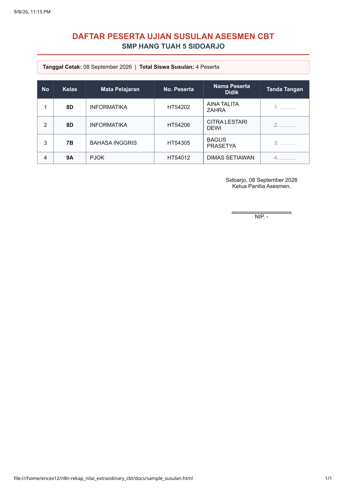

# 🤖 Bot Rekap Nilai CBT SMP Hang Tuah 5

Bot Telegram otomasi untuk memantau ujian, force-finish siswa yang belum submit, dan men-generate laporan rekap nilai resmi per kelas & mapel dalam format PDF siap cetak.

---

## 📑 Contoh Output Laporan PDF

Bot Telegram ini menghasilkan laporan berformat PDF resmi siap cetak (A4 Portrait) dengan kop surat sekolah, tabel nilai presisi, penandaan siswa belum ujian, serta kolom tanda tangan guru/panitia.

### 1. Laporan Rekapitulasi Nilai Asesmen CBT (Per Kelas & Mapel)
Dihasilkan melalui perintah `/rekap` atau `/pdf [KELAS]`. Menampilkan daftar seluruh siswa dalam rombel, nilai ujian CBT, kriteria KKM, serta penandaan jelas siswa yang belum ujian (*strip merah*).

<p align="center">
  
</p>

---

### 2. Laporan Daftar Siswa Ujian Susulan
Dihasilkan melalui perintah `/susulan` atau tombol **📋 Cek Susulan**. Otomatis mengidentifikasi siswa yang belum terekam nilainya di server CBT pada sesi ujian aktif hari itu, siap dicetak untuk daftar hadir ruang susulan.

<p align="center">
  
</p>

---

## ⚡ Instalasi Cepat (1 Langkah)

Untuk memasang bot di server baru atau laptop proktor (Linux Ubuntu / Debian):

```bash
# 1. Masuk ke folder project
cd /path/to/n8n-rekap_nilai_extraodinary_cbt

# 2. Jalankan script instalasi otomatis
chmod +x install.sh
./install.sh
```

Script ini otomatis:
1. Membuat file konfigurasi `.env` dari `.env.example`
2. Memeriksa & menginstal `python3` jika belum ada
3. Memeriksa & menginstal Google Chrome / Chromium (digunakan untuk print PDF headless)
4. Mendaftarkan bot ke `systemd` user service agar otomatis jalan 24/7 dan auto-start saat komputer menyala

---

## ⚙️ Konfigurasi Mudah (.env)

Anda hanya perlu mengedit file `.env` untuk mengatur akun dan URL:

```bash
nano .env
```

Isi file `.env`:
```env
# 1. Token Bot Telegram (didapat dari @BotFather)
TELEGRAM_BOT_TOKEN=your_bot_token_here

# 2. URL Website CBT (tanpa tanda garis miring / di ujung)
CBT_URL=https://cbt.sekolahanda.sch.id

# 3. Akun Login Admin CBT
CBT_EMAIL=admin_cbt@sekolah.sch.id
CBT_PASSWORD=your_password_here
```

Setelah mengubah file `.env`, cukup restart bot:
```bash
systemctl --user restart telegram-rekap-bot.service
```

---

## 🛠️ Perintah Manajemen Service

- **Cek Status Bot:**
  ```bash
  # Di Server (root):
  systemctl status telegram-rekap-bot.service

  # Di Laptop/Desktop (user biasa):
  systemctl --user status telegram-rekap-bot.service
  ```
- **Restart Bot:**
  ```bash
  systemctl restart telegram-rekap-bot.service         # Server
  systemctl --user restart telegram-rekap-bot.service  # Desktop
  ```
- **Stop Bot:**
  ```bash
  systemctl stop telegram-rekap-bot.service            # Server
  systemctl --user stop telegram-rekap-bot.service     # Desktop
  ```
- **Melihat Live Log:**
  ```bash
  journalctl -u telegram-rekap-bot.service -f          # Server
  journalctl --user -u telegram-rekap-bot.service -f   # Desktop
  ```

---

## 🔄 Cara Memperbarui Kode (Update Bot)

Jika ada pembaruan kode di GitHub, Anda memiliki **2 cara super mudah** untuk memperbarui bot di server tanpa repot:

### Cara 1: Langsung dari Chat Telegram (Paling Praktis)
Cukup ketik perintah ini di chat bot Telegram:
```text
/update
```
Bot akan otomatis menarik kode terbaru dari GitHub (`git pull`) dan me-restart dirinya sendiri! Anda tidak perlu membuka terminal/SSH ke server sama sekali.

### Cara 2: Dari Terminal Server
Jalankan script update:
```bash
./update.sh
```

---

## 📖 Panduan Penggunaan Lengkap
Untuk alur operasional harian proktor, skenario ujian susulan, dan daftar seluruh perintah bot di Telegram, silakan baca:
👉 [PANDUAN_PENGGUNAAN_BOT.md](file:///home/encex12/n8n-rekap_nilai_extraodinary_cbt/PANDUAN_PENGGUNAAN_BOT.md)
